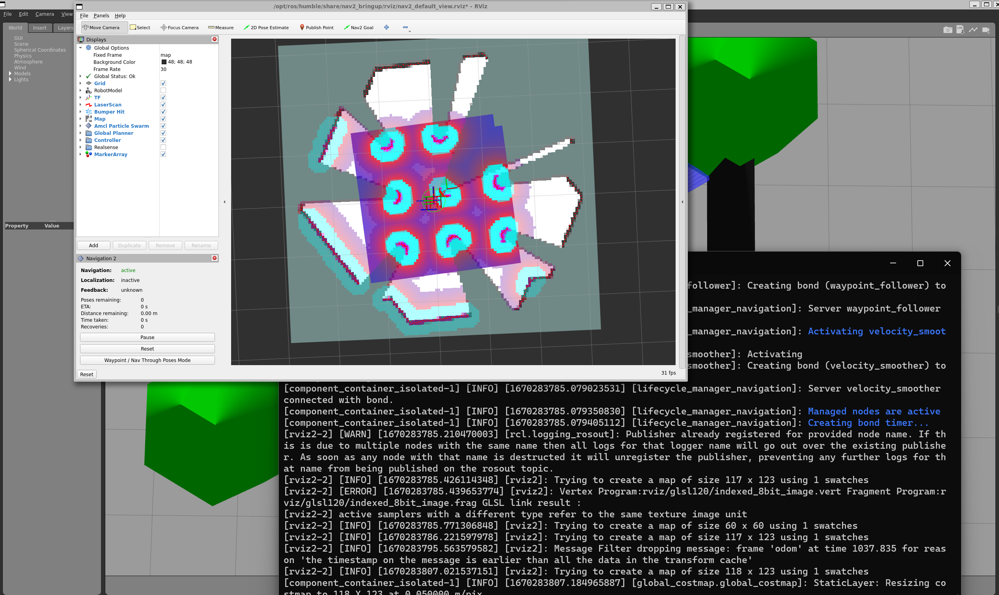

# walker_bot
[](https://opensource.org/licenses/MIT)

A walker algorithm using ros2 and turtlebot waffli-pi to avoid obstacles.

## Dependencies

- **Ubuntu 12.04**
- **ROS2 Humble**  
- **Turtlebot3 ROS Package**

## Installation 
1. All turtlebot3 pakages install
    ```bash
    sudo apt install ros-humble-turtlebot3*
    ```
2. Humble and Gazebo ROS packages
    ```bash
    sudo apt install ros-humble-gazebo-ros-pkgs 
    ```
3. Set up gazebo model path 
    ```bash
    export GAZEBO_MODEL_PATH=$GAZEBO_MODEL_PATH:`ros2 pkg \
    prefix turtlebot3_gazebo \
    `/share/turtlebot3_gazebo/models/
    ```
## Build your package
```bash
mkdir -p <your_workspace_path>/src
cd <your_workspace_path>/src
git clone https://github.com/AnukritiSinghh/walker_bot.git
cd <your_workspace_path>
colcon build --packages-select turtlebot3_walker
```
## Launch 
```
cd <your_workspace_path>/ros2_ws
source  install/setup.bash
ros2 launch turtlebot3_walker walker.launch.py enable_recording:=true
```
## ros bag recording 
```
ros2 bag info walker_bag
```

* Output


## Run cppcheck and cpplint
* The Output txt files will be saved under results folder  

For cppcheck
```bash
sh run_cppcheck.sh
```
For cpplint
```bash
sh run_cpplint.sh 
`````
